<div align="center">

[](https://github.com/zhasumit/)

</div>


<div style="font-size:18px;"><span style="font-size:24px;">⾕</span> <b>Noida, Uttar Pradesh, India</b></div>
<div style="font-size:18px;">💻 <b>Software Developer Engineer @ Prismberry</b></div> 
<div style="font-size:18px;"><span style="font-size:22px;">🏛</span> <b>Computer Science Undergraduate @ MNNIT Allahabad</b></div>  
<br>

<div>

# 🧩 About Me


- 🔍 Endlessly curious, passionate about continuous learning  
- ⚡ Strong foundation in programming, data structures & algorithms  
- 🤖 Exploring AI/ML to build intelligent, data-driven solutions  
- 🛠️ Designing scalable APIs & solving real-world problems  
- 🎨 Crafting interactive, pixel-perfect web experiences  
- 🧠 Logic lover & problem-solver, turning ideas into solutions  
</div>

<br>


# 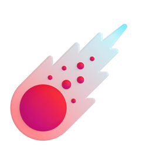 Topics I cover
<table align="center">

  <!-- Row 1 -->
  <td align="center" width="20%">
    <strong style="font-size:18px;">Languages</strong>
    <div style="display:flex;flex-wrap:wrap;gap:8px;justify-content:center;margin-top:10px;">
      
      
      
      
      
      
      
    </div>
  </td>

  <td align="center" width="20%">
    <strong style="font-size:18px;">Frontend</strong>
    <div style="display:flex;flex-wrap:wrap;gap:8px;justify-content:center;margin-top:10px;">
      
      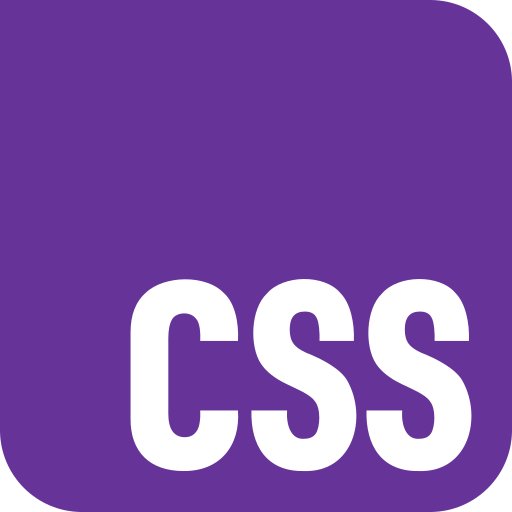
      
      
      
      
      
      
      
      
    </div>
  </td>

  <td align="center" width="20%">
    <strong style="font-size:18px;">Backend</strong>
    <div style="display:flex;flex-wrap:wrap;gap:8px;justify-content:center;margin-top:10px;">
      
      
      
      
      
      
      
      
      
      
    </div>
  </td>

  <td align="center" width="20%">
    <strong style="font-size:18px;">ML & Data</strong>
    <div style="display:flex;flex-wrap:wrap;gap:8px;justify-content:center;margin-top:10px;">
      
      
      
      
      
      
    </div>
  </td>


  <td align="center" width="20%">
    <strong style="font-size:18px;">Utilities</strong>
    <div style="display:flex;flex-wrap:wrap;gap:8px;justify-content:center;margin-top:10px;">
      
      
      
      
      
      
      
      
    </div>
  </td>


</table>

<br>


#  Recent feed activities 


[](https://github.com/zhasumit)


<table width="100%">
<tr>
<td align="center" width="50%">


**🔥 Streak Analytics**


</td>
<td align="center" width="50%">

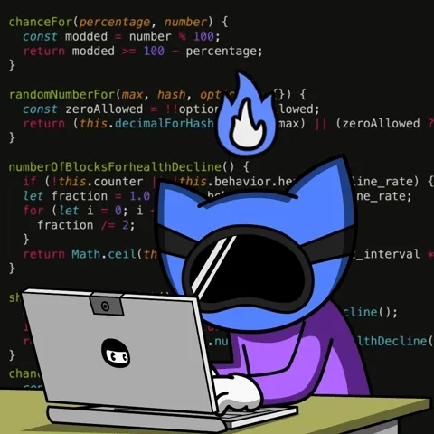

**🏆 Language Mastery Matrix**


</td>
</tr>
</table>


<br>

# Projects

<br>
<table align="center" width="100%" style="table-layout: fixed;">
<tr>
<!-- Project 8 -->
<td align="center" width="50%">
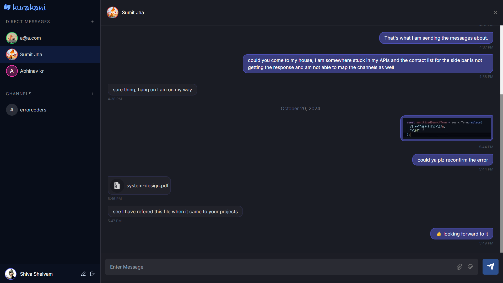

### Charcha
<strong style="color:#6c757d;">Language learning chat & community app</strong>

<div>


</div>
<p>
<span style="font-size: 15px;">💬 Real-time chat with threads & reactions</span><br>
<span style="font-size: 15px;">🎥 Seamless voice & video calls powered by Stream</span><br>
<span style="font-size: 15px;">🌍 Community spaces for collaborative language learning</span>
</p>


<p>
<a href="https://charcha-lpvh.onrender.com" target="_blank">Live ↗</a> <span style="color:gray;">⋮</span>  
<a href="https://github.com/zhasumit/charcha" target="_blank">Code ↗</a>
</p>
</td>

<td align="center" width="50%">

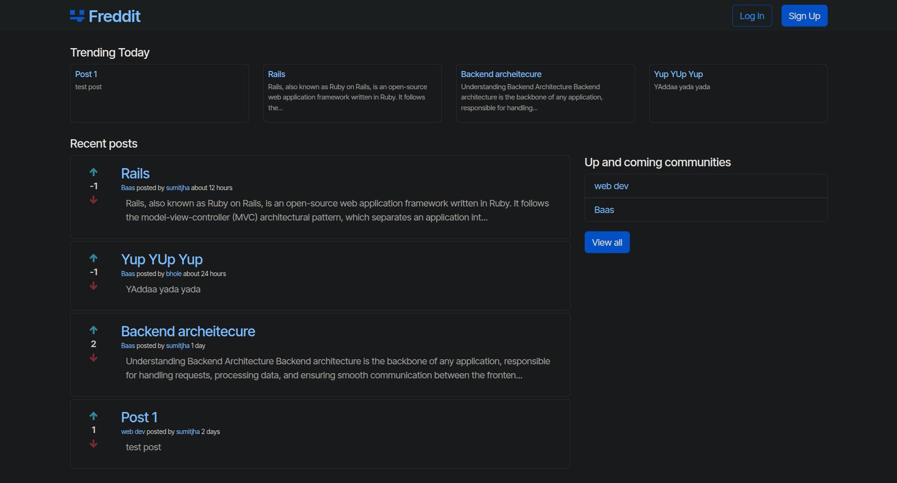

### Freddit
<strong style="color:#6c757d;">Reddit clone for community</strong>

<div>


</div>
<p>
<span style="font-size: 15px;">📝 Create & join topic-based communities for contributions</span><br>
<span style="font-size: 15px;">⬆️ Upvote, downvote & comment on posts</span><br>
<span style="font-size: 15px;">🔔 Real-time feed updates & user interactions</span>
</p>


<p>
<a href="https://github.com/zhasumit/freddit" target="_blank">Code ↗</a>
</p>
</td>

</tr>
<tr>
<!-- project 6 -->
<td align="center" width="50%">

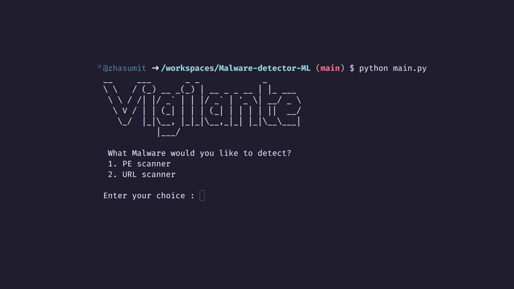

### Vigilante
<strong style="color:#6c757d;">Pipline based Malware detector</strong>

<div>


</div>
<p>
<span style="font-size: 15px;">🧪 End-to-end ML pipeline for malware detection</span><br>
<span style="font-size: 15px;">⚡ Fast feature extraction & classification</span><br>
<span style="font-size: 15px;">🔒 Lightweight Flask API for real-time scanning</span>
</p>


<p>
<a href="https://github.com/zhasumit/Malware-detector-ML" target="_blank">Code ↗</a>
</p>
</td>

<!-- Project 5 -->
<td align="center" width="50%">
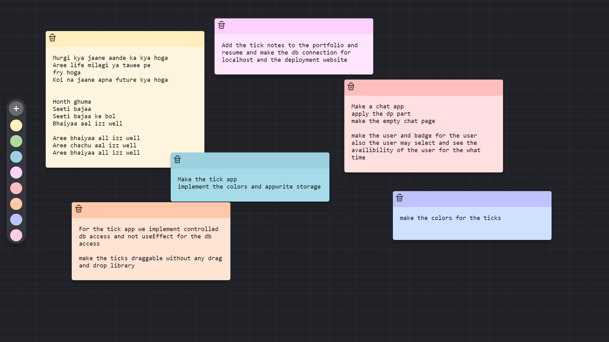

### Tick
<strong style="color:#6c757d;">Sticky notes app</strong>

<div>


</div>
<p>
<span style="font-size: 15px;">⚡ sharable broadcast based sticky notes</span><br>
<span style="font-size: 15px;">🗂️ Drag & Drop Task Management with 1000+ users at a time</span><br>
<span style="font-size: 15px;">📌 Organize with Boards & Notes and broadcastwith people</span>
</p>


<p>
<a href="https://tick-eight.vercel.app/" target="_blank">Live ↗</a> <span style="color:gray;">⋮</span>  
<a href="https://github.com/zhasumit/Tick" target="_blank">Code ↗</a>
</p>
</td>
</tr>

<tr>
<!-- project 4 -->
<td align="center" width="50%">

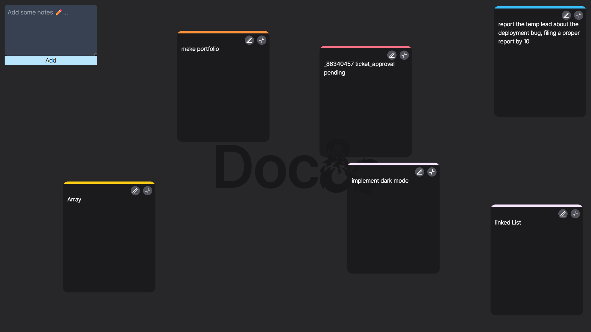

### Dragnotes
<strong style="color:#6c757d;">Drag based Notes app</strong>

<div>


</div>
<p>
<span style="font-size: 15px;">📝 Sticky notes with <b>local storage</b></span><br>
<span style="font-size: 15px;">⚡ Smooth drag-and-drop UI</span><br>
<span style="font-size: 15px;">🔒 Zero accounts • No tracking • <b>Privacy-first</b></span>
</p>

<p>
<a href="https://dragnote.vercel.app/" target="_blank">Live ↗</a> <span style="color:gray;">⋮</span>  
<a href="https://github.com/zhasumit/FrontEnd-projects/tree/main/DragDocs" target="_blank">Code ↗</a>
</p>
</td>

<!-- Project 3 -->
<td align="center" width="50%">
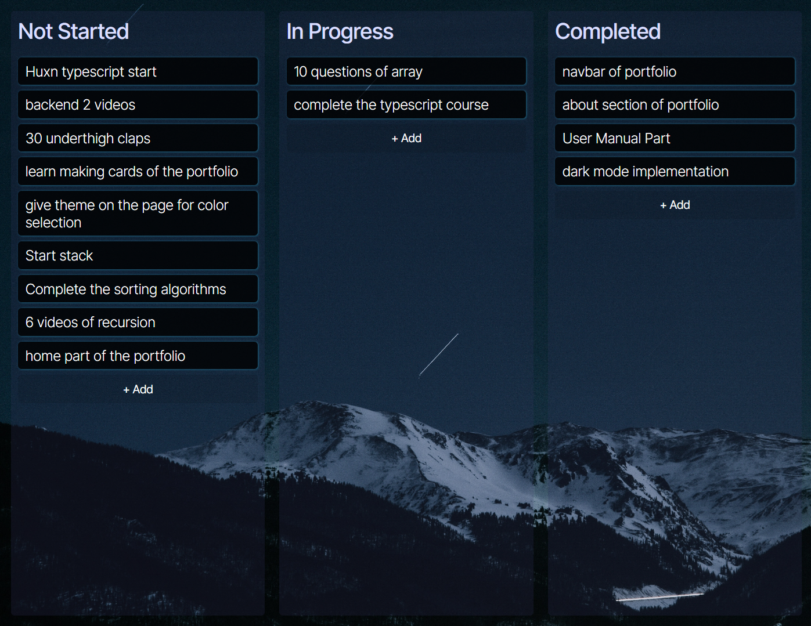

### Tugnotes
<strong style="color:#6c757d;">Simple Kanban</strong>

<div>


</div>
<p>
<span style="font-size: 15px;">⚡ Lightweight & Fast</span><br>
<span style="font-size: 15px;">🗂️ Drag & Drop Task Management</span><br>
<span style="font-size: 15px;">📌 Organize with Boards & Notes</span>
</p>


<p>
<a href="https://tugnote.vercel.app/" target="_blank">Live ↗</a> <span style="color:gray;">⋮</span>  
<a href="https://github.com/zhasumit/js-rookies/tree/main/18-TugNotes/v2" target="_blank">Code ↗</a>
</p>
</td>
</tr>

<tr>
<!-- project 2 -->
<td align="center" width="50%">

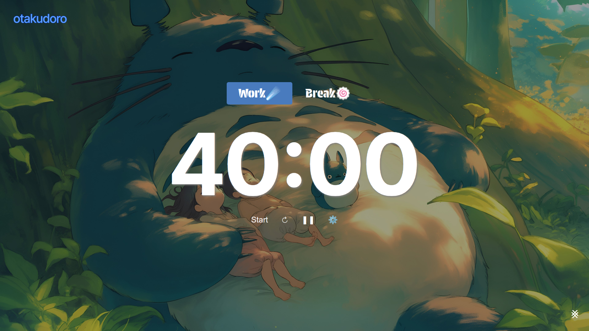

### Otakudoro
<strong style="color:#6c757d;">Anime based Pomodoro</strong>

<div>


</div>
<p>
<span style="font-size: 15px;">🍅 web pomodoro app</span><br>
<span style="font-size: 15px;">🍥 Custom anime themes  </span><br>
<span style="font-size: 15px;">💻 windows & linux pomodoro timer app</span>
</p>


<p>
<a href="https://otakudoro.vercel.app/" target="_blank">Live ↗</a> <span style="color:gray;">⋮</span>  
<a href="https://github.com/zhasumit/otakudoro" target="_blank">Code ↗</a>
</p>
</td>


<!-- Project 1 -->
<td align="center" width="50%">

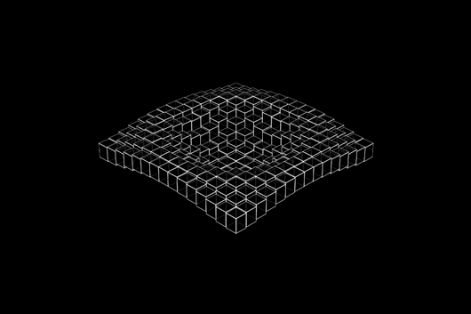

### Ziggle
<strong style="color:#6c757d;">Physics Animation</strong>

<div>


</div>
<p>
<span style="font-size: 15px;">🌀 Smooth Motion Physics</span><br>
<span style="font-size: 15px;">⚡ Dynamic Visual Effects</span>
</p>

<p>
<a href="https://ziggle-cubes.vercel.app/" target="_blank">Live ↗</a> <span style="color:gray;">⋮</span>  
<a href="https://github.com/zhasumit/js-rookies/blob/main/22-ziggle/index.html" target="_blank">Code ↗</a>
</p>
</td>
</tr>

</table>

<br>


#  Let's connect 

<div align="center">
<table>
<tr>

<td >
<a href="https://github.com/zhasumit/" target="_blank" style="color:white;text-decoration:none;">


**`{}` Github**
</a>
</td>

<td >
<a href="mailto:sumitjha1618@gmail.com" target="_blank" style="color:white;text-decoration:none;">
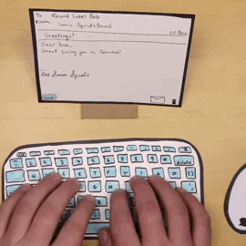

**`@`email**
</a>
</td>

<td >
<a href="https://www.sumitjha.dev/" target="_blank" style="color:white;text-decoration:none;">
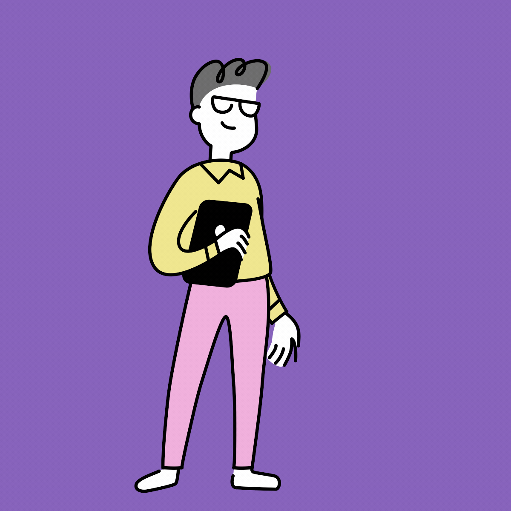

**`ඞ` Portfolio**
</a>
</td>

<td >
<a href="#" target="_blank" style="color:white;text-decoration:none;">


**`⌐╦ᡁ᠊╾━` Resume**
</a>
</td>

<td >
<a href="https://www.linkedin.com/in/sumitjha1618/" target="_blank" style="color:white;text-decoration:none;">


**`[in]` Linkedin**
</a>
</td>


</tr>
<tr>
<td >
<a href="https://www.x.com/__sumitjha/" target="_blank" style="color:white;text-decoration:none;">


**`𝕏` Twitter**
</a>
</td>
<td >
<a href="https://hashnode.com/@sumitjha404" target="_blank" style="color:white;text-decoration:none;">


**`🪢` Hashnode**
</a>
</td>

<td >
<a href="https://www.instagram.com/sumitk.jha/" target="_blank" style="color:white;text-decoration:none;">


**`[◉¯]` instagram**
</a>
</td>

<td >
<a href="https://discord.com/users/784362664037580841" target="_blank" style="color:white;text-decoration:none;">


**`⛩` discord**
</a>
</td>

<td >
<a href="https://wa.me/7294043415" target="_blank" style="color:white;text-decoration:none;">


**`🗣` whatsapp**
</a>
</td>
</tr>
</tr>
</table>
</div>

<br>


##  Ready to Collaborate? **Open for**

<table align="center">
<tr>
<td align="center">


**💼 Full-Time Roles**
*Ready for new challenges*

</td>
<td align="center">


**🚀 Freelance Projects**
*Let's build something amazing*

</td>
<td align="center">


**🤝 Open Source**
*Contributing for community*

</td>
<td align="center">


**💡 Tech Discussions**
*Always up for a good debate*

</td>
</tr>
</table>


## ⚡ 25' goals
<table align="center">

<tr>
  <td width="50%">
    <strong>Foundation Strengthening</strong>
        
```python
🐍 Python + OOP                     ██████████ 100%
📊 NumPy / Pandas                   ████████░░  80%
📉 Visualization (Matplotlib)       ██████░░░░  60%
📚 Math + Statistics                █████░░░░░  50%
🗂️ SQL + Databases                  █████░░░░░  45%
☁️ Git & Version Control            ███████░░░  65%
```

  </td>
  <td width="50%">
    <strong>Core computer Science</strong>

```python
📦 Data Structures & Algorithms     ████████░░  80%
🧮 Discrete Mathematics             ██████░░░░  60%
🧵 Operating Systems                ███████░░░  70%
🌐 Computer Networks                ██████░░░░  65%
🗄️ Database Management (DBMS)       ███████░░░  75%
🤖 ML Basics (Sklearn/NNs)          ████░░░░░░  40%
```

  </td>
</tr>
<tr>
  <td width="50%">
    <strong>Data structures</strong>
        
```python
Arrays & Strings                 ██████████ 100%
Linked Lists (Singly/Doubly)     ████████░░  80%
Stacks & Queues                  ███████░░░  75%
Trees (BST, AVL, Heap)           ██████░░░░  65%
Graphs                           ██████░░░░  60%
Hashing & Hashmaps               ██████░░░░  60%
Searching & Sorting Algorithms   ███████░░░  70%
Recursion & Divide & Conquer     █████░░░░░  50%
Dynamic Programming              █████░░░░░  45%
Tries & Advanced Trees           ████░░░░░░  40%
```

  </td>
  <td width="50%">
    <strong>System Archietecture</strong>

```python
📝 Low-Level Design (LLD)           ████████░░  80%
📐 High-Level Design (HLD)          ██████░░░░  65%
🔁 Design Patterns (OOP)            ███████░░░  70%
🔗 APIs & Integration               ██████░░░░  60%
📦 Microservices & Containers       █████░░░░░  55%
⚖️ Scalability & Load Balancing     ████░░░░░░  40%
🛡️ Security & Authentication        ████░░░░░░  35%
☁️ Cloud-Native Architecture        ████░░░░░░  40%
```

  </td>
</tr>
</table>

<br>


<br>
<div align="center">

##### **Made with ❤️, compiled with ☕, and debugged through countless hours of 💻**

</div>