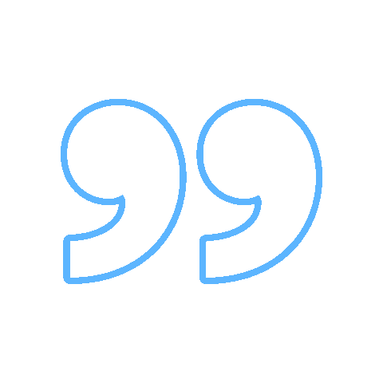

### 

I'm Sumit Kumar Jha, an undergraduate in CS from MNNIT ALlahabad. I am open to create and contribute full-stack projects. I really enjoy building software, creating and contributing to data-science projects and helping others.
  

## 📎 About me

-   love coffee
    
-   chronic patient of curiosity
    
-   doing front-end projects currently
    
-   Undergraduate from MNNIT Allahabad
    
-   chain coder for designer interactive websites
    
-   Love building logic and algorithms
    

## ⚡Topics I cover

  <kbd>
    <kbd>Languages</kbd>
     
     
     
     
     
     
     
  </kbd>
  <kbd>
    <kbd>Front-end</kbd>
     
     
     
     
     
     
  </kbd>
  <kbd>
    <kbd>Back-end</kbd>
     
     
     
     
     
     
  </kbd>
  <kbd>
    <kbd>Databases</kbd>
     
     
     
     
  </kbd>
  <kbd>
    <kbd>Library/FrameWorks</kbd>
     
     
     
     
     
     
  </kbd>
  <kbd>
    <kbd>OS</kbd>
     
     
     
     
    
  </kbd>
  <kbd>
    <kbd>Tools</kbd>
     
     
     
     
     
     
     
  </kbd>

##  Streaks

  

##  Let's connect 

 
 
 

 